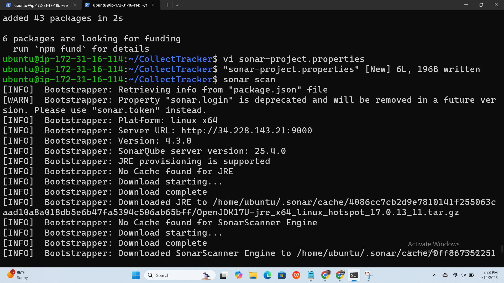

# Deploying CollectTracker on AWS EC2 with SonarQube Analysis (Revised)

This guide outlines the steps to deploy the `CollectTracker` application on an Amazon EC2 instance, install necessary dependencies, and perform static code analysis using SonarQube, with a focus on using `sonar-project.properties`.

## Step 1: Launch EC2 Instance

1.  **Launch Instance:**
    * Navigate to the AWS EC2 console.
    * Click "Launch Instance" and provide a descriptive name (e.g., "CollectTracker-Server").
    * Select an appropriate Amazon Machine Image (AMI), such as Ubuntu Server 20.04 or later.
    * Choose an instance type (e.g., t2.medium).
    * Create or select an existing key pair for SSH access.
    * Configure the security group:
        * Allow SSH (port 22) from your IP address.
        * **Crucially, allow TCP traffic on port 9000** for SonarQube access.
2.  **Note:** After the instance launches, record its public IP address.

## Step 2: Connect to EC2 and Clone Repository

1.  **SSH into the instance:**
    ```bash
    ssh -i your-key.pem ubuntu@<your-ec2-public-ip>
    ```
    Replace `your-key.pem` with the path to your key pair and `<your-ec2-public-ip>` with the instance's public IP.
2.  **Update package lists:**
    ```bash
    sudo apt update
    ```
3.  **Clone the CollectTracker repository:**
    ```bash
    git clone https://github.com/Bighairymtnman/CollectTracker.git
    cd CollectTracker/
    ```

## Step 3: Install Dependencies and Configure SonarScanner

1.  **Install Node.js and npm:**
    ```bash
    sudo apt install npm
    ```
2.  **Install project dependencies:**
    ```bash
    npm install
    ```
3.  **Verify Node.js and npm versions:**
    ```bash
    npm -v
    node -v
    ```
4.  **Build the application:**
    ```bash
    npm run build
    ```
5.  **Install SonarScanner globally:**
    ```bash
    sudo npm install -g @sonar/scan
    ```
6.  **Create and configure `sonar-project.properties`:**
    ```bash
    vi sonar-project.properties
    ```

    Add the following content to `sonar-project.properties`, adjusting as needed:

    ```properties
    sonar.projectKey=CollectTracker
    sonar.projectName=CollectTracker
    sonar.projectVersion=1.0
    sonar.sources=.
    sonar.host.url=http://<your-ec2-public-ip>:9000
    sonar.login=<your-sonar-token>
    ```
    

    * Replace `<your-ec2-public-ip>` with your EC2 instance's public IP.
    * Replace `<your-sonar-token>` with your SonarQube authentication token.
7.  **Run SonarScanner:**
    ```bash
    sonar-scanner
    ```

## Step 4: Install and Start SonarQube

1.  **Install OpenJDK 17:**
    ```bash
    sudo apt install openjdk-17-jdk
    ```
2.  **Download SonarQube:**
    ```bash
    wget https://binaries.sonarsource.com/Distribution/sonarqube/sonarqube-9.9.0.65466.zip
    ```
    * **Note:** I have changed the sonarqube version to 9.9.0.65466 as 25.4.0.105899 is not a valid version. Please check the latest stable version and update the download link.
3.  **List files:**
    ```bash
    ls
    ```
4.  **Install unzip:**
    ```bash
    sudo apt install unzip
    ```
5.  **Unzip SonarQube:**
    ```bash
    unzip sonarqube-9.9.0.65466.zip
    ```
6.  **List files:**
    ```bash
    ls
    ```
7.  **Navigate to the SonarQube binary directory:**
    ```bash
    cd sonarqube-9.9.0.65466/
    cd bin
    cd linux-x86-64/
    ```
8.  **Start SonarQube:**
    ```bash
    ./sonar.sh start
    ```
9.  **Check SonarQube status:**
    ```bash
    sudo systemctl status sonarqube
    ```
    * If the service is not running via systemctl, just use the `./sonar.sh status` command.
10. **Alternative Maven Sonar Plugin execution (If needed):**
    * Install maven if it is not installed.
        ```bash
        sudo apt install maven
        ```
    * Run the maven sonar plugin from the root of the CollectTracker project.
        ```bash
        mvn sonar:sonar -Dsonar.host.url=http://<your-ec2-public-ip>:9000 -Dsonar.login=<your-sonar-token> -Dsonar.java.binaries=target/classes
        ```
        * Replace `<your-ec2-public-ip>` and `<your-sonar-token>` with the correct values.
        * Note: this is only needed if your project is maven based. If you have created the `sonar-project.properties` file correctly, you can use `sonar-scanner`.

## Step5:

* Access SonarQube at `http://<your-ec2-public-ip>:9000`.
* Log in with the default credentials (admin/admin) on first access, and immediately change the password.
* Generate a token in SonarQube for authentication and use it in `sonar-project.properties`.
* Ensure that port 9000 is open in your security group.
* SonarQube may take some time to start. Check the logs in `sonarqube-9.9.0.65466/logs/sonar.log` for any errors.
* Adjust memory settings in `sonarqube-9.9.0.65466/conf/sonar.properties` if you encounter performance issues.
* The `sonar-project.properties` file is the preferred method for configuring SonarScanner for non-Maven projects.


