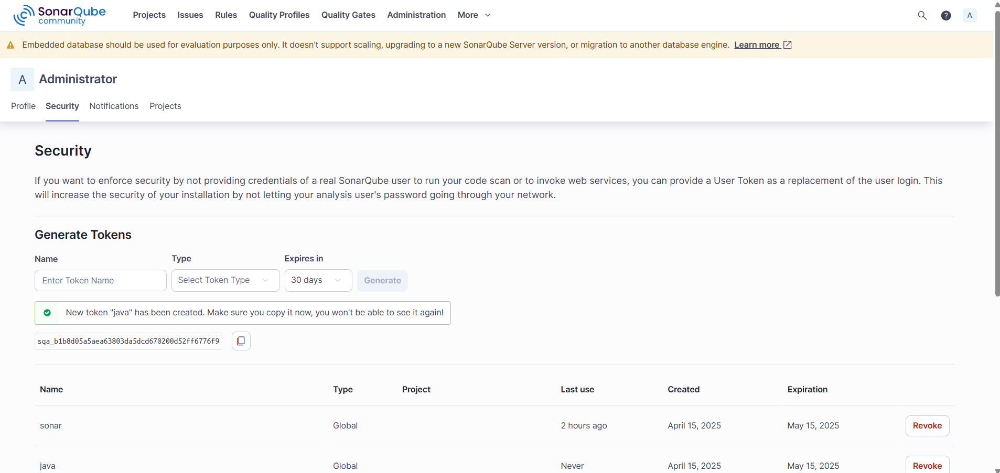
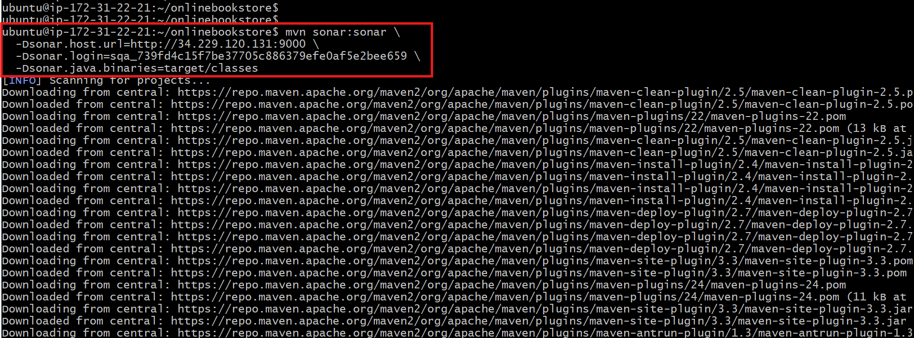
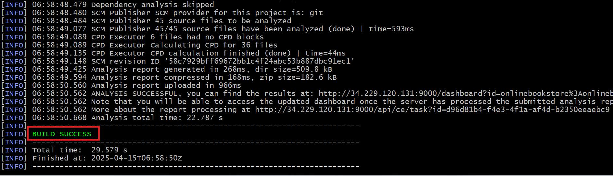
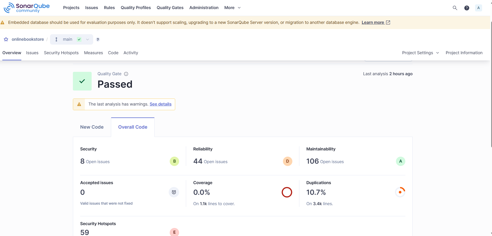

## Setting up SonarQube on EC2 and Analyzing a Maven Project

This document outlines the steps to set up SonarQube on an EC2 instance, configure it, and analyze a Maven project.

**STEP 1: Create an EC2 Server**

* **Server Size:** t2.medium
* **Security Group:**
    * SSH (port 22)
    * Custom TCP (port 9000)

**STEP 2: Connect via SSH and Install SonarQube**

* Connect to the EC2 instance using SSH:
    ```bash
    ssh -i your-key.pem ubuntu@<your-ec2-public-ip>
    ```
* Install Java 17:
    ```bash
    sudo apt install openjdk-17-jre-headless
    ```
* Verify Java installation:
    ```bash
    java --version
    ```
* Download SonarQube (version 25.4.0.105899):
    ```bash
    wget https://binaries.sonarsource.com/Distribution/sonarqube/sonarqube-25.4.0.105899.zip
    ```
* Extract the downloaded ZIP file:
    ```bash
    unzip sonarqube-25.4.0.105899.zip
    ```

**STEP 3: Configure and Start SonarQube**

* Navigate to the SonarQube directory:
    ```bash
    cd sonarqube-25.4.0.105899
    ```
* Navigate to the bin directory:
    ```bash
    cd bin
    ```
* Navigate to the Linux x86-64 directory:
* Start SonarQube:
    ```bash
    ./sonar.sh start
    ```

**STEP 4: Access SonarQube Web Interface**

* Open a web browser and navigate to:
    ```
    http://<your-ec2-public-ip>:9000
    ```
* You should see the SonarQube web interface.
* Generate Token to integrate with maven
  

**STEP 5: Install Maven, Clone the Project, and Analyze with SonarQube**

* Clone the Maven project:
    ```bash
    git clone https://github.com/shashirajraja/onlinebookstore.git
    ```
* Navigate to the project directory:
    ```bash
    cd onlinebookstore
    ```
* Install Maven:
    ```bash
    sudo apt install maven -y
    ```
* Build the project:
    ```bash
    mvn package
    ```
* Analyze the project with SonarQube:
    ```bash
    mvn sonar:sonar \
      -Dsonar.host.url=http://<your-ec2-public-ip>:9000 \
      -Dsonar.login=sqa_739fd4c15f7be37705c886379efe0af5e2bee659 \
      -Dsonar.java.binaries=target/classes
    ```
    
    

    **Important:** Replace `<your-ec2-public-ip>` with the actual public IP address of your EC2 instance.

**STEP 6: Check Code Quality in SonarQube GUI**

* Return to the SonarQube web interface (http://<your-ec2-public-ip>:9000).
* You should now see the analyzed project and its code quality metrics.
  
  