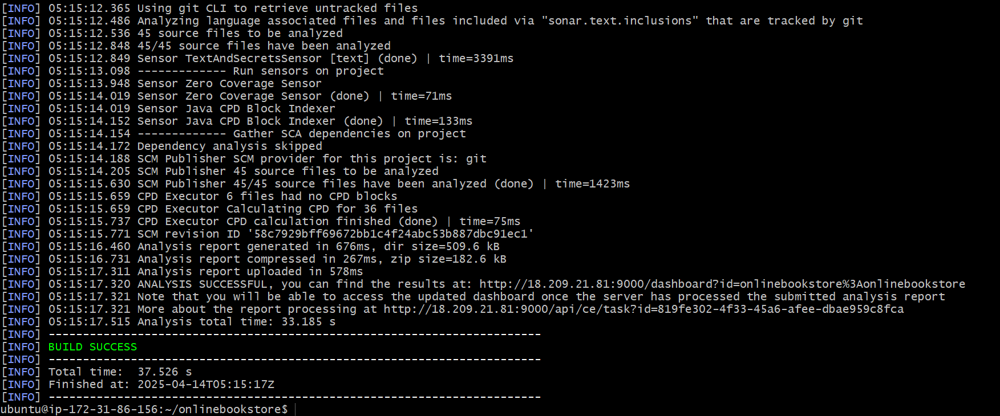

## SonarQube Setup and Maven Analysis

## STEP 1: Launch EC2 Instance

1.  **Launch Instance:**
    * Navigate to the EC2 dashboard in the AWS Management Console.
    * Click "Launch instance.
    * Provide a name for your instance.
    * Select an appropriate Amazon Machine Image (AMI) (e.g., Ubuntu).
    * Choose or create a key pair for SSH access.
    * Configure security group settings to allow inbound traffic on port 9000.

## STEP 2: Connect to EC2 via SSH

1.  **SSH Connection:**
    * Open a terminal and use the following command to connect to your EC2 instance:
        ```bash
        ssh -i your-key.pem ubuntu@<your-ec2-public-ip>
        ```
    * Replace `your-key.pem` with the path to your key pair file and `<your-ec2-public-ip>` with the public IP address of your EC2 instance.
2.  **Install Git (if needed):**
    * Check if Git is installed:
        ```bash
        git --version
        ```
    * If Git is not installed, install it:
        ```bash
        sudo apt update
        sudo apt install git -y
        ```
3.  **Clone Repository:**
    * Clone the onlinebookstore repository:
        ```bash
        git clone https://github.com/shashirajraja/onlinebookstore.git
        ```
4.  **Navigate to Repository:**
    * Change directory to the cloned repository:
        ```bash
        cd onlinebookstore
        ```

## STEP 3: Install Maven

1.  **Install Maven:**
    ```bash
    sudo apt install maven -y
    ```
2.  **Check Maven Version:**
    ```bash
    mvn -version
    ```
1.  **Install OpenJDK 17:**
    ```bash
    sudo apt install openjdk-17-jdk
    ```

2.  **Download SonarQube:**
    ```bash
    wget [https://binaries.sonarsource.com/Distribution/sonarqube/sonarqube-25.4.0.105899.zip]
    ```

3.  **List Files:**
    ```bash
    ls
    ```

4.  **Install Unzip:**
    ```bash
    sudo apt install unzip
    ```

5.  **Unzip SonarQube:**
    ```bash
    unzip sonarqube-25.4.0.105899.zip
    ```

6.  **List Files:**
    ```bash
    ls
    ```

7.  **Navigate to SonarQube Directory:**
    ```bash
    cd sonarqube-25.4.0.105899/
    ```

8.  **Navigate to Bin Directory:**
    ```bash
    cd bin
    ```

9.  **Navigate to Linux x86-64 Directory:**
    ```bash
    cd linux-x86-64/
    ```

10. **Start SonarQube:**
    ```bash
    ./sonar.sh start
    ```

11. **Check SonarQube Status:**
    ```bash
    sudo systemctl status sonarqube
    ```

12. **Update Package Lists:**
    ```bash
    sudo apt update
    ```

13. **Check Java Version:**
    ```bash
    java --version
    ```

14. **Install Maven:**
    ```bash
    sudo apt install maven -y
    ```

15. **Check Java Version:**
    ```bash
    java --version
    ```

16. **Clone Git Repository:**
    ```bash
    git clone https://github.com/shashirajraja/onlinebookstore.git

17. **Navigate to Repository Directory:**
    ```bash
    cd onlinebookstore/
    ```

18. **Build Project with Maven:**
    ```bash
    mvn package
    ```

19. **Run SonarQube Analysis:**
    ```bash
    mvn sonar:sonar -Dsonar.host.url= http://18.209.21.81:9000 http://18.209.21.81:9000 -Dsonar.login=sqa_f982f549d71dccbe8f4417d5b166e372d92c3d79 -Dsonar.java.binaries=target/classes
    ```
    
    
    