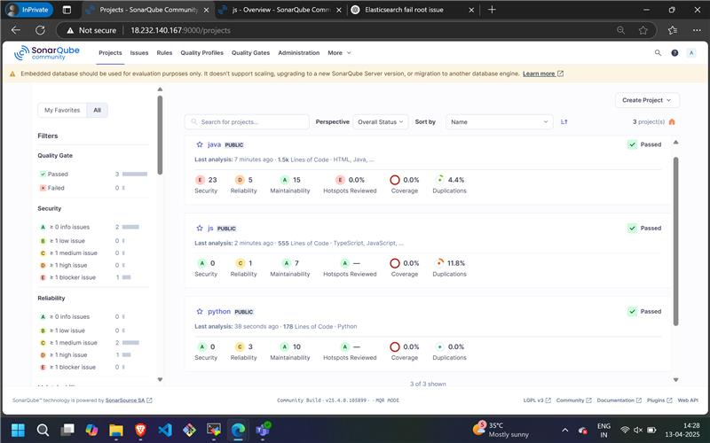

## Steps to Set Up and Run SonarQube on an EC2 Instance (Enhanced)

**STEP 1: Launch EC2 Instance (with Considerations)**

-   Launch a new EC2 instance.
-   Provide a descriptive name for the instance (e.g., "SonarQubeServer").
-   **AMI Selection:** Choose an Ubuntu Server LTS (Long Term Support) AMI for stability.
-   **Instance Type:** Consider using a `t2.medium` or larger instance for adequate performance, especially for larger codebases.
-   **Key Pair:** Create or select a secure key pair for SSH access. Store the `.pem` file safely.
-   **Security Group:**
    -      Allow inbound SSH (port 22) from your IP or a restricted range.
    -      Allow inbound HTTP (port 9000) for SonarQube web access.
    -   Allow inbound traffic on port 8501 as requested.
-   **Storage:** Ensure sufficient EBS volume size for SonarQube and your project data.

**STEP 2: Connect to EC2 via SSH and Clone Repository**

-   Connect to the EC2 instance using SSH:
    ```bash
    ssh -i your-key.pem ubuntu@<your-ec2-public-ip>
    ```
-   Update package lists:
    ```bash
    sudo apt update
    ```
-   Verify if Git is installed:
    ```bash
    git --version
    ```
-   If Git is not installed, install it:
    ```bash
    sudo apt install git -y
    ```
-   Clone the SolarX repository:
    ```bash
    git clone [https://github.com/MainakRepositor/SolarX.git](https://github.com/MainakRepositor/SolarX.git)
-   Navigate to the SolarX directory:
    ```bash
    cd SolarX
    ```

**STEP 3: Install and Start SonarQube (with Database Setup)**

1.  Install OpenJDK 17:
    ```bash
    sudo apt install openjdk-17-jdk -y
    ```
2.  Download SonarQube:
    ```bash
    wget [https://binaries.sonarsource.com/Distribution/sonarqube/sonarqube-25.4.0.105899.zip](https://binaries.sonarsource.com/Distribution/sonarqube/sonarqube-25.4.0.105899.zip)
3.  Install unzip:
    ```bash
    sudo apt install unzip -y
    ```
4.  Unzip the SonarQube archive:
    ```bash
    unzip sonarqube-25.4.0.105899.zip
    ```
5.  Navigate to the SonarQube bin directory:
    ```bash
    cd sonarqube-25.4.0.105899/bin
    ```
6.  Navigate to the linux-x86-64 directory:
    ```bash
    cd linux-x86-64/
    ```
7.  **Database Configuration (Important):**
    -   SonarQube requires a database (PostgreSQL is recommended).
    -   Install PostgreSQL:
        ```bash
        sudo apt install postgresql postgresql-contrib -y
        ```
    -   Create a SonarQube user and database in PostgreSQL.
        ```bash
        sudo -u postgres psql
        CREATE USER sonar WITH PASSWORD 'your_sonar_password';
        CREATE DATABASE sonar OWNER sonar;
        GRANT ALL PRIVILEGES ON DATABASE sonar TO sonar;
        \q
        ```
    -   Configure SonarQube to use PostgreSQL by editing `sonarqube-25.4.0.105899/conf/sonar.properties`:
        ```
        sonar.jdbc.username=sonar
        sonar.jdbc.password=your_sonar_password
        sonar.jdbc.url=jdbc:postgresql://localhost:5432/sonar
        ```
8.  Start SonarQube:
    ```bash
    ./sonar.sh start
    ```
9.  Check SonarQube status:
    ```bash
    sudo systemctl status sonarqube
    ```

**STEP 4: Install SonarScanner and Run Analysis (with Token and Configuration)**

1.  Update the package list:
    ```bash
    sudo apt update
    ```
2.  Install npm:
    ```bash
    sudo apt install npm -y
    ```
3. Navigate to the /opt/ directory.
    ```bash
    cd /opt/
    ```
4.  Download SonarScanner:
    ```bash
    sudo wget [https://binaries.sonarsource.com/Distribution/sonar-scanner-cli/sonar-scanner-cli-5.0.1.3006-linux.zip](https://binaries.sonarsource.com/Distribution/sonar-scanner-cli/sonar-scanner-cli-5.0.1.3006-linux.zip)
5.  Install unzip:
    ```bash
    sudo apt install unzip -y
    ```
6.  Unzip SonarScanner:
    ```bash
    unzip sonar-scanner-cli-5.0.1.3006-linux.zip
    ```
7.  Set up SonarScanner environment variables:
    ```bash
    sudo vi /etc/profile.d/sonar-scanner.sh
    ```
    - Add the following line, adjusted to your path:
        ```bash
        export PATH=$PATH:/opt/sonar-scanner-5.0.1.3006-linux/bin
        ```
    - Save and close the file.
8.  Source the environment variables:
    ```bash
    source /etc/profile.d/sonar-scanner.sh
    ```
9.  Verify SonarScanner installation:
    ```bash
    sonar-scanner -v
    ```
10. **Generate SonarQube Token:**
    -   Log in to the SonarQube web interface (http://`<your-ec2-public-ip>`:9000).
    -   Navigate to "My Account" -> "Security" -> "Generate Tokens".
    -   Copy the generated token.
11. Run SonarScanner analysis:
    ```bash
    sonar-scanner \
      -Dsonar.projectKey=python \
      -Dsonar.sources=. \
      -Dsonar.host.url=http://<your-ec2-public-ip>:9000 \
      -Dsonar.token=your_generated_token
    ```
    -   Replace `<your-ec2-public-ip>` with the public IP address of your EC2 instance.
    -   Replace `your_generated_token` with the token you generated.
    -   **Important:** Store the token securely. Never expose it in public repositories or scripts.
12. **SonarQube Web Interface:** Access SonarQube at http://`<your-ec2-public-ip>`:9000 to view the analysis results.


